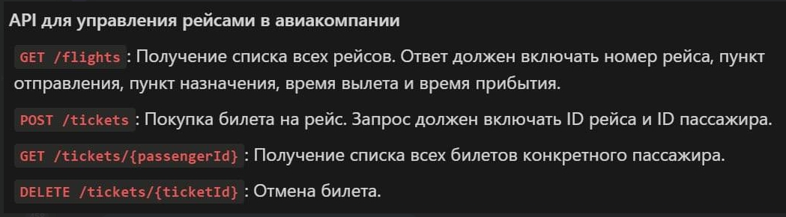

# Экзамен по КПО

Задание:

Для запуска проекта, необоходимо поднять Postgres на порту localhost:5432 и подключиться к базе данных. 
Далее можно запустить проект, для вывода всех полетов используется пагинация, чтобы можно было удобнее обрабатывать запросы в дальнейшем, так же используется система обработок исключений с кастомными кодами, чтобы было проще понимать на фронте какие ошибки.